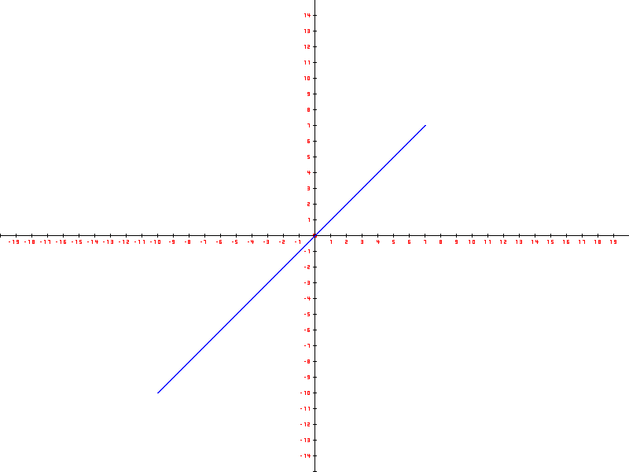
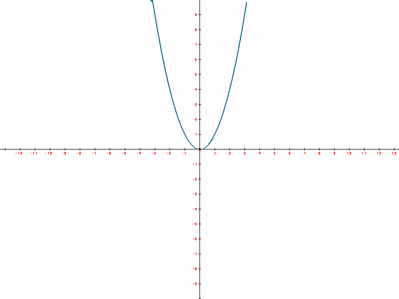
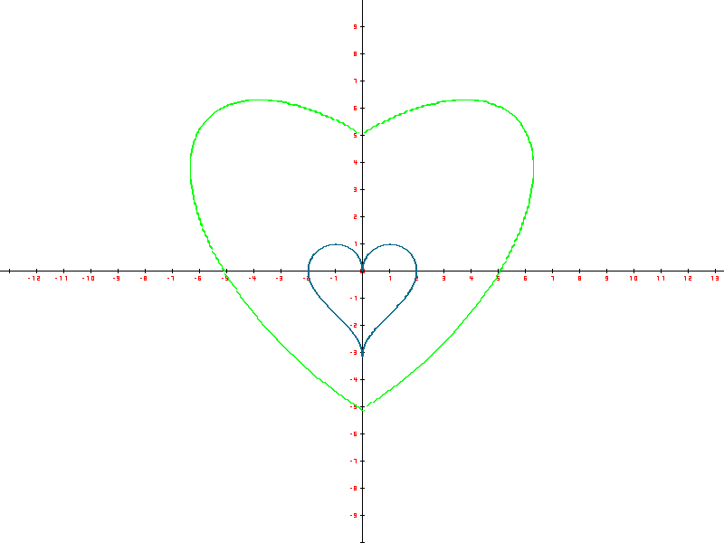
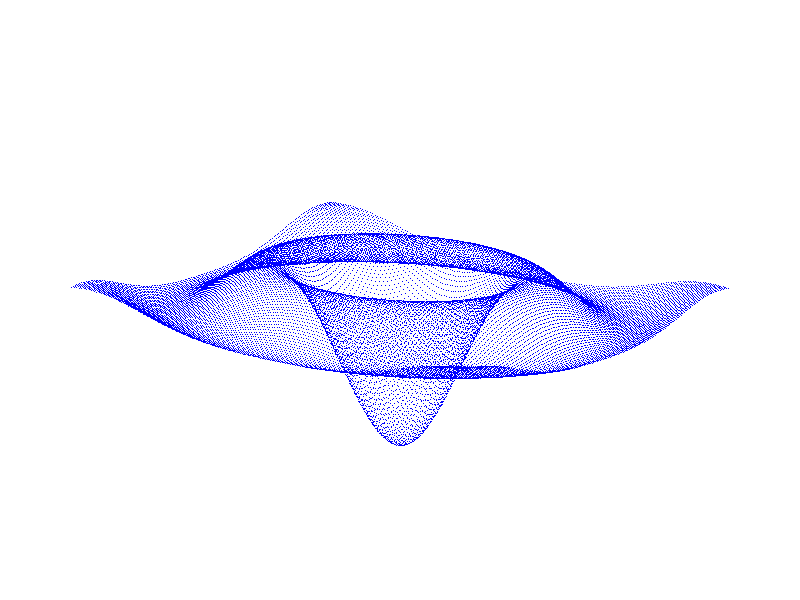

## MyPlot
This project implements a rough, start-from-sketch tool to draw 2D and 3D mathematical functions and graphs in C++. This is a universial function grapher that can adapt to draw any mathematical functions. Some examples are shown below. This project was part of the final project of Tsinghua University's Program Design course.
### Examples
- Function $f(x)=x$ from $-10$ to $7$

- Function $f(x)=x^2$

- Parameter functions in the shape of heart

- 3D function in the shape of hat

### Usage
To draw customized graphs using this tool, call either `plot2D`(for unary functions), `plotPara` (for parameter functions), or `plot3D` (for 3D graphs) in `plot.cpp` with the customized functions written in the form of C++ functions.
### Collaborator
This project was done in collaboration with Tsinghua freshmen Yifu Tang, Haimeng Zhao, and Yichen Zhang (in no particular order).